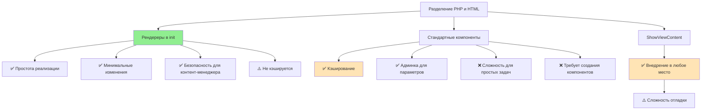

# План рефакторинга: Разделение PHP и HTML для безопасного редактирования

## Анализ текущего состояния

### index.php (главная страница)

| Блок | Строки | Тип | Статус |
|------|--------|------|--------|
| banner-main | 5-20 | HTML | ✅ Безопасная зона |
| society | 21-93 | HTML | ✅ Безопасная зона |
| opportunities | 94-126 | HTML | ✅ Безопасная зона |
| boards (Совет) | 127-166 | PHP + инфоблок | ⚠️ Опасная зона |
| initiative (Проекты) | 167-276 | PHP + инфоблок | ⚠️ Опасная зона |
| history | 276-325 | HTML | ✅ Безопасная зона |
| culture | 326-387 | HTML | ✅ Безопасная зона |
| new-project | 388-420 | HTML | ✅ Безопасная зона |
| membership | 421-498 | HTML | ✅ Безопасная зона |
| partner form | 499-540 | HTML + функция | ⚠️ Условно безопасно |
| news | 541-586 | PHP + инфоблок | ⚠️ Опасная зона |

### about/index.php (страница "О нас")

| Блок | Строки | Тип | Статус |
|------|--------|------|--------|
| banner, director | 5-48 | HTML | ✅ Безопасная зона |
| boards (Совет) | 49-86 | PHP + инфоблок | ⚠️ Опасная зона |
| history, charter, house, first-people, revival | 87-281 | HTML | ✅ Безопасная зона |
| documents | 282-347 | HTML | ✅ Безопасная зона |
| board modals | 349-366 | PHP + инфоблок | ⚠️ Опасная зона |

---

## Сравнение подходов



### Рекомендация

Для текущего проекта выбран **подход с PHP-рендерерами** по следующим причинам:

| Критерий | Рендереры | Компоненты | ShowViewContent |
|----------|-----------|------------|-----------------|
| Сложность реализации | Низкая | Высокая | Средняя |
| Время на внедрение | 1-2 дня | 1-2 недели | 1-2 дня |
| Безопасность для контента | ✅ | ✅ | ✅ |
| Кэширование | ❌ | ✅ | ❌ |
| Гибкость настройки | Средняя | Высокая | Низкая |
| Совместимость с текущим кодом | ✅ | ❌ | ⚠️ |

### Почему не выбраны другие подходы

1. **Стандартные компоненты Битрикса** (`bitrix:news.list` и т.д.)
   - Требуют создания собственных компонентов
   - Длинный цикл разработки
   - Избыточно для простой выборки данных
   - Не подходит под текущую архитектуру

2. **ShowViewContent / SetViewTarget**
   - Сложность в отладке
   - Менее очевидная структура кода
   - Ограниченные возможности передачи параметров

### Выбранный подход обеспечивает

- **Изоляцию PHP-логики** — инфоблоки читаются только в рендерерах
- **Чистый HTML для редактирования** — контент-менеджер работает только с HTML
- **Обратную совместимость** — существующие функции продолжают работать
- **Простоту отладки** — каждый рендерер можно протестировать отдельно

---

## Рекомендуемое решение: Буферизированные PHP-рендереры

### Принцип работы

```
┌─────────────────────────────────────────────────────────┐
│  local/php_interface/renderers/                          │
│  ├── board_section.php      — рендерит секцию "Совет"   │
│  ├── projects_section.php   — рендерит "Проекты"        │
│  ├── news_section.php       — рендерит "Новости"        │
│  └── board_modals.php       — рендерит модальные окна   │
└─────────────────────────────────────────────────────────┘
                          │
                          ▼
┌─────────────────────────────────────────────────────────┐
│  index.php / about/index.php                            │
│                                                          │
│  <?php po_render_board_section(); ?>                     │
│  <?php po_render_projects_section(); ?>                  │
│  <?php po_render_news_section(); ?>                      │
│                                                          │
│  <!-- Всё остальное — чистый HTML для визуального редактора -->
└─────────────────────────────────────────────────────────┘
```

### Преимущества

1. **Безопасность**: Контент-менеджер может редактировать HTML между вызовами функций
2. **Сохранность PHP**: Логика инфоблоков изолирована в отдельных файлах
3. **Обратная совместимость**: Существующий функционал не ломается
4. **Простота отладки**: Каждый рендерер можно тестировать отдельно

---

## Структура файлов для создания

### 1. `local/php_interface/renderers/board_section.php`

```php
<?php
/**
 * Рендерит секцию "Члены Совета Политехнического общества"
 * Использует инфоблок IBLOCK_BOARD_ID
 */

if (!function_exists('po_render_board_section')) {
    function po_render_board_section(): void {
        $items = [];
        
        if (defined('IBLOCK_BOARD_ID') && IBLOCK_BOARD_ID > 0 && \Bitrix\Main\Loader::includeModule('iblock')) {
            $dbBoard = CIBlockElement::GetList(
                ['SORT' => 'ASC'],
                ['IBLOCK_ID' => IBLOCK_BOARD_ID, 'ACTIVE' => 'Y'],
                false,
                ['nTopCount' => 12],
                ['ID', 'NAME', 'PREVIEW_PICTURE', 'PREVIEW_TEXT']
            );

            while ($board = $dbBoard->GetNext()) {
                $items[] = [
                    'name' => (string)$board['NAME'],
                    'pos' => (string)$board['PREVIEW_TEXT'],
                    'photo' => !empty($board['PREVIEW_PICTURE']) 
                        ? CFile::GetPath($board['PREVIEW_PICTURE']) 
                        : '',
                ];
            }
        }
        
        if (empty($items)) {
            return; // Ничего не выводим, если данных нет
        }
        ?>
        <section class="boards">
        <div class="container">
            <div class="boards__wrapper">
                <h2 class="main-title">Члены Совета Политехнического общества</h2>
                <div class="boards__list">
                    <?php foreach ($items as $item): ?>
                    <div class="boards__item">
                        <?php if (!empty($item['photo'])): ?>
                        " 
                             src="<?= htmlspecialchars($item['photo']) ?>" 
                             class="boards__item-image">
                        <?php endif; ?>
                        <h3 class="boards__item-title"><?= htmlspecialchars($item['name']) ?></h3>
                        <p class="boards__item-text"><?= htmlspecialchars($item['pos']) ?></p>
                    </div>
                    <?php endforeach; ?>
                </div>
            </div>
        </div>
        </section>
        <?php
    }
}
```

### 2. `local/php_interface/renderers/projects_section.php`

```php
<?php
/**
 * Рендерит секцию "Проекты общества"
 * Использует инфоблок IBLOCK_PROJECTS_ID
 */

if (!function_exists('po_render_projects_section')) {
    function po_render_projects_section(): void {
        // Fallback данные (если инфоблок пуст)
        $fallbackProjects = [
            ['name' => 'Конференция PolytechExpo', 'url' => '/projects/politech-expo/', 
             'img' => 'initiative-img-1.png', 'mob' => 'initiative-img-mob-1.png'],
            ['name' => 'Конференция Встреча выпускников', 'url' => '/projects/conference/', 
             'img' => 'initiative-img-2.png', 'mob' => 'initiative-img-mob-2.png'],
            ['name' => 'Попечительский совет', 'url' => '/projects/trustees/', 
             'img' => 'initiative-img-3.png', 'mob' => 'initiative-img-mob-3.png'],
            ['name' => 'Реставрации Ротонды', 'url' => '/projects/restoration/', 
             'img' => 'initiative-img-4.png', 'mob' => 'initiative-img-mob-4.png'],
        ];

        $projects = [];
        $desktopFallback = ['initiative-img-1.png', 'initiative-img-2.png', 'initiative-img-3.png', 'initiative-img-4.png'];
        $mobileFallback = ['initiative-img-mob-1.png', 'initiative-img-mob-2.png', 'initiative-img-mob-3.png', 'initiative-img-mob-4.png'];

        if (defined('IBLOCK_PROJECTS_ID') && IBLOCK_PROJECTS_ID > 0 && \Bitrix\Main\Loader::includeModule('iblock')) {
            $dbProjects = CIBlockElement::GetList(
                ['SORT' => 'ASC', 'ID' => 'ASC'],
                ['IBLOCK_ID' => IBLOCK_PROJECTS_ID, 'ACTIVE' => 'Y'],
                false, false,
                ['ID', 'NAME', 'DETAIL_PAGE_URL', 'PREVIEW_PICTURE', 'PROPERTY_HOME_IMAGE', 
                 'PROPERTY_HOME_IMAGE_MOB', 'PROPERTY_DETAIL_URL']
            );
            $idx = 0;
            while ($proj = $dbProjects->GetNext()) {
                $homeImageId = (int)($proj['PROPERTY_HOME_IMAGE_VALUE'] ?? 0);
                $homeMobId = (int)($proj['PROPERTY_HOME_IMAGE_MOB_VALUE'] ?? 0);
                $previewId = (int)($proj['PREVIEW_PICTURE'] ?? 0);

                $desktopImg = '';
                foreach ([$homeImageId, $previewId] as $cid) {
                    if ($cid > 0) {
                        $path = CFile::GetPath($cid);
                        if ($path) { $desktopImg = $path; break; }
                    }
                }
                if (!$desktopImg) {
                    $desktopImg = SITE_TEMPLATE_PATH . '/assets/img/' . $desktopFallback[$idx % 4];
                }

                $mobileImg = '';
                foreach ([$homeMobId, $homeImageId, $previewId] as $cid) {
                    if ($cid > 0) {
                        $path = CFile::GetPath($cid);
                        if ($path) { $mobileImg = $path; break; }
                    }
                }
                if (!$mobileImg) {
                    $mobileImg = SITE_TEMPLATE_PATH . '/assets/img/' . $mobileFallback[$idx % 4];
                }

                $detailUrl = trim((string)($proj['PROPERTY_DETAIL_URL_VALUE'] ?? ''));
                if (!$detailUrl) {
                    $detailUrl = trim((string)($proj['DETAIL_PAGE_URL'] ?? ''));
                }
                if (!$detailUrl) {
                    $detailUrl = '/projects/detail/?id=' . (int)$proj['ID'];
                }

                $projects[] = [
                    'name' => (string)$proj['NAME'],
                    'url' => $detailUrl,
                    'img' => $desktopImg,
                    'mob' => $mobileImg,
                ];
                $idx++;
            }
        }

        if (empty($projects)) {
            foreach ($fallbackProjects as $fp) {
                $projects[] = [
                    'name' => $fp['name'],
                    'url' => $fp['url'],
                    'img' => SITE_TEMPLATE_PATH . '/assets/img/' . $fp['img'],
                    'mob' => SITE_TEMPLATE_PATH . '/assets/img/' . $fp['mob'],
                ];
            }
        }
        ?>
        <section class="initiative">
        <div class="container">
            <div class="initiative__wrapper">
                <div class="initiative__info">
                    <h2 class="main-title">Проекты общества</h2>
                    <p class="main-text">Члены общества запустили важные проекты Политеха. 
                    Станьте частью братства и используйте все возможности общества.</p>
                </div>
                <?php foreach ($projects as $project): ?>
                <a href="<?= htmlspecialchars($project['url']) ?>" class="initiative__card">
                    <h3><?= htmlspecialchars($project['name']) ?></h3>
                    " 
                         src="<?= htmlspecialchars($project['img']) ?>" 
                         class="initiative__image desk-block">
                    " 
                         src="<?= htmlspecialchars($project['mob']) ?>" 
                         class="initiative__image desk-none">
                </a>
                <?php endforeach; ?>
            </div>
        </div>
        </section>
        <?php
    }
}
```

### 3. `local/php_interface/renderers/news_section.php`

```php
<?php
/**
 * Рендерит секцию "Новости и события"
 * Использует инфоблоки IBLOCK_NEWS_ID и IBLOCK_EVENTS_ID
 */

if (!function_exists('po_render_news_section')) {
    function po_render_news_section(int $limit = 6): void {
        $newsItems = [];

        if (\Bitrix\Main\Loader::includeModule('iblock')) {
            $iblockIds = [];
            if (defined('IBLOCK_NEWS_ID') && IBLOCK_NEWS_ID > 0) {
                $iblockIds[] = IBLOCK_NEWS_ID;
            }
            if (defined('IBLOCK_EVENTS_ID') && IBLOCK_EVENTS_ID > 0) {
                $iblockIds[] = IBLOCK_EVENTS_ID;
            }

            if (!empty($iblockIds)) {
                $dbNews = CIBlockElement::GetList(
                    ['DATE_ACTIVE_FROM' => 'DESC', 'ID' => 'DESC'],
                    ['IBLOCK_ID' => $iblockIds, 'ACTIVE' => 'Y'],
                    false,
                    ['nTopCount' => $limit],
                    ['ID', 'NAME', 'DATE_ACTIVE_FROM', 'PREVIEW_PICTURE', 'IBLOCK_ID']
                );

                while ($item = $dbNews->GetNext()) {
                    $img = $item['PREVIEW_PICTURE']
                        ? CFile::GetPath($item['PREVIEW_PICTURE'])
                        : SITE_TEMPLATE_PATH . '/assets/img/news-img.png';
                    
                    $date = $item['DATE_ACTIVE_FROM']
                        ? date('d.m.Y', strtotime($item['DATE_ACTIVE_FROM']))
                        : '';

                    $newsItems[] = [
                        'id' => (int)$item['ID'],
                        'name' => (string)$item['NAME'],
                        'img' => $img,
                        'date' => $date,
                    ];
                }
            }
        }
        ?>
        <section class="news">
        <div class="container">
            <h2 class="main-title news__title">Новости и события</h2>
            <div class="news__wrapper">
                <?php if (!empty($newsItems)): ?>
                    <?php foreach ($newsItems as $item): ?>
                    <a href="/news/detail/?id=<?= $item['id'] ?>" class="news__card">
                        " 
                             src="<?= htmlspecialchars($item['img']) ?>">
                        <div class="news__content">
                            <h3 class="news__card-title"><?= htmlspecialchars($item['name']) ?></h3>
                            <div class="news__row">
                                <p class="news__date"><?= htmlspecialchars($item['date']) ?></p>
                            </div>
                        </div>
                    </a>
                    <?php endforeach; ?>
                <?php else: ?>
                    <p style="color:#888">Новости скоро появятся</p>
                <?php endif; ?>
            </div>
            <a href="/news/" class="btn news__btn btn-transparent">Все новости</a>
        </div>
        </section>
        <?php
    }
}
```

### 4. `local/php_interface/renderers/board_modals.php`

```php
<?php
/**
 * Рендерит модальные окна для членов Совета (about page)
 * Использует инфоблок IBLOCK_BOARD_ID
 */

if (!function_exists('po_render_board_modals')) {
    function po_render_board_modals(): void {
        $members = [];

        if (defined('IBLOCK_BOARD_ID') && IBLOCK_BOARD_ID > 0 && \Bitrix\Main\Loader::includeModule('iblock')) {
            $dbBoard = CIBlockElement::GetList(
                ['SORT' => 'ASC'],
                ['IBLOCK_ID' => IBLOCK_BOARD_ID, 'ACTIVE' => 'Y'],
                false, false,
                ['ID', 'NAME', 'PREVIEW_PICTURE', 'PREVIEW_TEXT', 'DETAIL_TEXT']
            );

            while ($bm = $dbBoard->GetNext()) {
                $members[] = $bm;
            }
        }

        foreach ($members as $bm): 
            $photoSrc = !empty($bm['PREVIEW_PICTURE'])
                ? CFile::GetPath($bm['PREVIEW_PICTURE'])
                : SITE_TEMPLATE_PATH . '/assets/img/board-placeholder.png';
        ?>
        <div class="form-boards" id="board-modal-<?= (int)$bm['ID'] ?>" style="display:none;max-width:1100px;">
            <div class="form-boards__wrapper">
                " 
                     src="<?= htmlspecialchars($photoSrc) ?>" 
                     class="form-boards__image">
                <div class="form-boards__content">
                    <h2><?= htmlspecialchars($bm['NAME']) ?></h2>
                    <?php if (!empty($bm['DETAIL_TEXT'])): ?>
                    <div><?= $bm['DETAIL_TEXT'] ?></div>
                    <?php else: ?>
                    <p><?= htmlspecialchars($bm['PREVIEW_TEXT']) ?></p>
                    <?php endif; ?>
                </div>
            </div>
        </div>
        <?php 
        endforeach;
    }
}
```

---

## Последовательность миграции

### Этап 1: Создание файлов-рендереров
1. Создать папку `local/php_interface/renderers/`
2. Создать файлы по образцам выше
3. Подключить автозагрузку в `local/php_interface/init.php`

### Этап 2: Обновление index.php
1. Добавить вызов `po_render_board_section()` вместо строк 127-166
2. Добавить вызов `po_render_projects_section()` вместо строк 167-276
3. Добавить вызов `po_render_news_section()` вместо строк 541-586
4. Проверить работоспособность

### Этап 3: Обновление about/index.php
1. Добавить вызов `po_render_board_section()` вместо строк 49-86
2. Добавить вызов `po_render_board_modals()` перед `</main>` (строки 349-366)

### Этап 4: Тестирование
1. Проверить все блоки на обеих страницах
2. Убедиться, что данные из инфоблоков отображаются
3. Проверить fallback-логику

---

## Результат после миграции

```
┌─────────────────────────────────────────────────────────┐
│  index.php                                              │
│                                                          │
│  <main>                                                  │
│  <!-- banner, society, opportunities — HTML -->          │
│                                                          │
│  <?php po_render_board_section(); ?>  ← инфоблок        │
│                                                          │
│  <?php po_render_projects_section(); ?> ← инфоблок      │
│                                                          │
│  <!-- history, culture, new-project, membership — HTML -->
│                                                          │
│  <?php po_render_news_section(); ?> ← инфоблок          │
│  </main>                                                 │
└─────────────────────────────────────────────────────────┘
```

Контент-менеджер может редактировать любой HTML-блок между вызовами функций без риска сломать PHP-логику.
